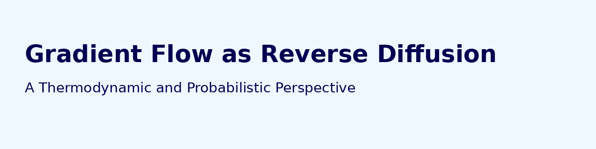
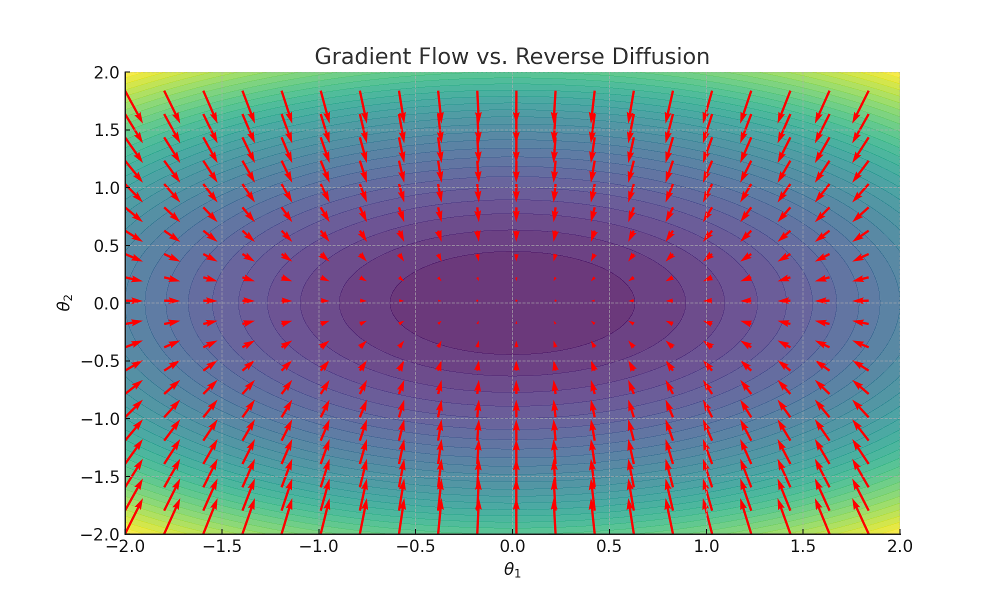

# Gradient Flow as Reverse Diffusion



> Gradient descent can be interpreted as a deterministic reverse-time diffusion process, connecting optimization to score-based generative modeling.

[](LICENSE)

## 📄 Paper Overview

This repository contains the full LaTeX source code, mathematical formulation, toy experiments, and figures for the paper:

**Viewing Gradient Flow as Reverse Diffusion: A Thermodynamic and Probabilistic Perspective**

Gradient descent in deep learning can be seen as a deterministic trajectory that mirrors the reverse process of a stochastic diffusion. By framing optimization dynamics using the language of probability flow ODEs, we build a theoretical bridge between score-based generative modeling, Wasserstein gradient flows, and thermodynamic interpretations of learning.

## 🧠 Highlights

- Interprets gradient descent as a reverse-time probability flow
- Links Fokker-Planck, diffusion models, and variational optimization
- Introduces toy experiments on 2D quadratic loss landscapes
- Includes LaTeX and figures to compile the full paper

## 📁 Repository Structure

```
├── main.tex                 # LaTeX source of the paper
├── refs.bib                # BibTeX references
├── gradient_flow_banner.png # GitHub header image
├── figures/
│   └── trajectory.png      # Toy experiment plot
├── arxiv_metadata.txt      # ArXiv abstract and categories
└── README.md               # This file
```

## 📊 Example Figure



## 📦 How to Compile the Paper

```bash
pdflatex main.tex
bibtex main
pdflatex main.tex
pdflatex main.tex
```

This will generate `main.pdf`, the full paper.

## 📖 License

MIT License
